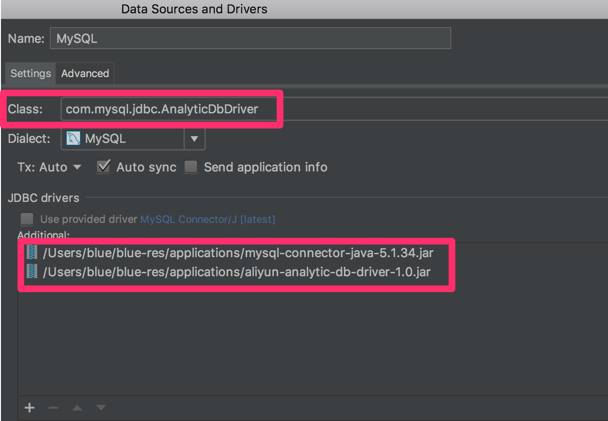

阿里云分析型数据库（AnalyticDB）坑太多暂时放弃使用
* 数据更新有延时（一分钟以内），官方有说明，没有很好的工具生态，但不是放弃的主要原因
* 对 MYSQL JDBC 驱动有版本要求，但关键是出错原因一般无法轻易定位
* 虽说官方宣称兼容mysql语法，但对SQL的支持很弱，比如：很多情况下不支持SQL别名，关键是不一定有错误提示
* 官方宣称支持multivalue多值列类型，当时这个也是我们强烈需要的特性，但我们没有弄明白怎么插入值，也没什么资料可查
* 工期紧已经无法再花时间继续填坑了，只能期待以后更佳成熟了（日期：2017-08-22 ）
* 已转到PostgreSQL，只花了一天不到的时间就完成了技术评估测试，适合我们的业务需求

阿里云分析型数据库（AnalyticDB）JDBC 驱动
============================
# 说明
> 因阿里云分析型数据库（AnalyticDB）不支持别名加星号的语句(例：`SELECT d.* FROM demo d`)，但支持不加别名的语句`SELECT * FROM demo d`，
> 导致基于JDBC的数据库客户端如果以含别名的方式就无法打开表，此项目基于mysql-connector-java的5.1.34版本做了一层驱动的包装去掉了别名
> 使客户端能正常打开表，此驱动只适合基于JDBC的数据库GUI客户端，不用于实际开发。

# 使用
1. 添加`mysql-connector-java`和 `aliyun-analytic-db-driver`
2. 使用驱动：`com.mysql.jdbc.AnalyticDbDriver`

# 下载
[drivers.zip](https://github.com/javaercn/aliyun-analytic-db-driver/files/1218376/drivers.zip)

# 样例
jetbrains 系列的数据库客户端使用样例

# 其它
> mysql-connector-java的5.1.34版本对阿里云分析型数据库（AnalyticDB）兼容性较好。
> [官方说明](https://help.aliyun.com/knowledge_list/35322.html)
